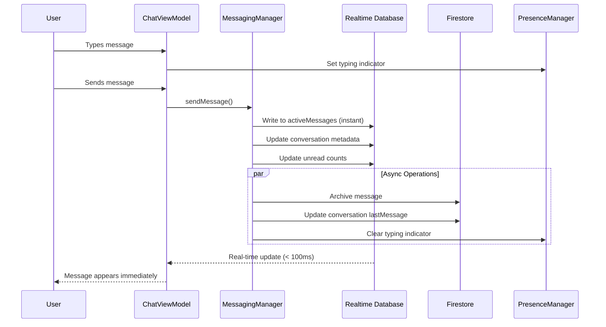

# Swift Send

A real-time messaging app for iOS with **Hybrid Firestore + RTDB Architecture** for maximum performance, built with SwiftUI and Firebase.

## ✨ Features

### Core Messaging
- **⚡ Lightning-Fast Delivery** - Sub-100ms message delivery using RTDB
- **💬 Group Messaging** - Create group conversations with multiple participants
- **👥 Direct Messages** - One-on-one conversations
- **📱 Real-time Updates** - Instant message synchronization across devices
- **✅ Delivery & Read Receipts** - Track message delivery and read status
- **⌨️ Typing Indicators** - See when others are typing
- **🟢 Presence Status** - Online/offline indicators for users
- **📜 Message History** - Persistent message storage with pagination

### User Experience
- **User Profiles** - Display names and profile pictures
- **Mentions & Threads** - @mention users and star important messages
- **Unread Tracking** - Badge counts for unread messages
- **Message Types** - Text, images, videos, files, and system messages
- **Context Menus** - Long-press for quick actions (star, copy, delete)

### Performance & Scalability
- **Hybrid Architecture** - RTDB for real-time + Firestore for persistence
- **Offline Support** - Built-in offline persistence for both databases
- **Efficient Pagination** - Load older messages on demand
- **Smart Caching** - Minimize database reads and costs

## 🏗️ Architecture

### Hybrid Firestore + RTDB Design

Swift Send uses a sophisticated **dual-database architecture** that combines the strengths of both Firebase services:

#### Firebase Realtime Database (RTDB)
**Purpose**: Real-time message delivery and ephemeral state
- Active messages (last 50 per conversation)
- Delivery status tracking
- Read receipts
- Typing indicators
- User presence (online/offline/away)
- Per-user conversation metadata (unread counts, last read)

#### Cloud Firestore
**Purpose**: Persistence, history, and queryability
- Conversation metadata and member details
- Archived messages (complete history)
- User profiles
- Final delivery status snapshots
- Searchable and queryable data

### Why This Architecture?

| Aspect | RTDB | Firestore |
|--------|------|-----------|
| **Latency** | <100ms | 200-500ms |
| **Real-time** | Excellent | Good |
| **Queries** | Limited | Powerful |
| **Cost** | Storage-based | Operation-based |
| **Best For** | Live updates | Historical data |

**Combined Benefits:**
- ⚡ Near-instant message delivery (RTDB)
- 💾 Complete message history (Firestore)
- 🔍 Powerful search and filtering (Firestore)
- 💰 Optimized costs (right tool for each job)
- 📱 Excellent offline support (both)

## 🗂️ Data Structure

### 🧩 Key Components

#### Managers
- **`AuthManager`** - Firebase Authentication & user state
- **`MessagingManager`** - Hybrid dual-write messaging logic
- **`FirestoreManager`** - Firestore operations (persistence layer)
- **`RealtimeManager`** - RTDB operations (real-time layer)
- **`PresenceManager`** - User presence & typing indicators
- **`UserProfileManager`** - User profile CRUD operations

#### Views
- **`MainView`** - Conversation list with unread badges
- **`ChatDetailView`** - Message thread with typing indicators & read receipts
- **`UnifiedMessageView`** - Single-screen new message flow (replaces multi-step wizard)
- **`ProfileView`** - Edit user profile
- **`ProfileSetupView`** - Initial onboarding flow

#### Reusable Components
- **`MessageBubble`** - Individual message display
- **`TypingIndicatorView`** - Shows who's typing
- **`ProfilePictureView`** - User avatars
- **`MessageInputView`** - Message composition field
- **`RecipientSelectorBar`** - Search and select recipients
- **`ConversationPreviewArea`** - Shows messages or empty state

#### ViewModels
- **`MainViewModel`** - Conversation list state & Firestore listeners
- **`ChatViewModel`** - Message state, RTDB listeners, presence & typing
- **`UnifiedMessageViewModel`** - New message flow state & real-time conversation detection

#### Utilities
- **`DataSeeder`** - Generate sample data for testing
- **`MigrationHelper`** - Migrate from legacy to hybrid architecture

### 📊 Database Structures

#### Firestore Collections

```javascript
// Conversations (Firestore)
conversations/{conversationId}
  ├─ id: string
  ├─ type: "direct" | "group"
  ├─ name: string? (for groups)
  ├─ createdAt: Timestamp
  ├─ createdBy: string (userId)
  ├─ memberIds: [string] (array of userIds)
  ├─ memberDetails: {
  │    userId: {
  │      displayName: string
  │      photoURL: string?
  │      joinedAt: Timestamp
  │    }
  │  }
  ├─ lastMessage: {
  │    text: string
  │    senderId: string
  │    senderName: string
  │    timestamp: Timestamp
  │    type: string
  │  }
  └─ metadata: {
       totalMessages: number
       imageUrl: string?
     }

// Archived Messages (Firestore subcollection)
conversations/{conversationId}/messages/{messageId}
  ├─ id: string
  ├─ conversationId: string
  ├─ senderId: string
  ├─ senderName: string
  ├─ text: string
  ├─ type: "text" | "image" | "video" | "file" | "system"
  ├─ timestamp: Timestamp
  ├─ mediaUrl: string?
  ├─ replyToMessageId: string?
  ├─ finalDeliveryStatus: {
  │    delivered: [string]
  │    failed: [string]
  │    read: [string]
  │  }
  ├─ isDeleted: boolean
  ├─ isEdited: boolean
  └─ editedAt: Timestamp?

// User Profiles (Firestore)
userProfiles/{userId}
  ├─ id: string
  ├─ email: string
  ├─ displayName: string
  ├─ photoURL: string?
  └─ createdAt: Timestamp
```

#### RTDB Paths

```javascript
// Active Messages (RTDB) - Last 50 messages
conversations/{conversationId}/activeMessages/{messageId}
  ├─ id: string
  ├─ senderId: string
  ├─ senderName: string
  ├─ text: string
  ├─ type: string
  ├─ timestamp: ServerValue.timestamp()
  ├─ mediaUrl: string?
  ├─ replyToMessageId: string?
  ├─ deliveryStatus: {
  │    userId: {
  │      status: "pending" | "sent" | "delivered" | "failed"
  │      timestamp: number
  │    }
  │  }
  └─ readBy: {
       userId: timestamp
     }

// Conversation Metadata (RTDB)
conversations/{conversationId}/metadata
  ├─ lastActivity: timestamp
  └─ typingUsers: {
       userId: timestamp (when started typing)
     }

// Conversation Members (RTDB) - For security rules
conversationMembers/{conversationId}
  └─ userId: true

// User Conversation Status (RTDB)
userConversations/{userId}/{conversationId}
  ├─ conversationId: string
  ├─ lastReadMessageId: string?
  ├─ lastReadTimestamp: number?
  ├─ unreadCount: number
  ├─ isPinned: boolean
  ├─ isMuted: boolean
  └─ lastMessageTimestamp: number

// User Presence (RTDB)
presence/{userId}
  ├─ status: "online" | "offline" | "away"
  ├─ lastSeen: timestamp
  └─ currentConversation: string? (conversationId)

// Legacy Support (RTDB)
users/{userId}/chats/{chatId}
  └─ [legacy chat structure]

users/{userId}/mentionedMessages/{mentionId}
  └─ [mentioned message data]
```

## 🚀 Setup

### 1. Firebase Configuration

#### a. Add Firebase to Your Project
1. Add your `GoogleService-Info.plist` to the project
2. The project uses Firebase iOS SDK v12.4.0+ with these services:
   - Firebase Authentication
   - Firebase Realtime Database
   - Cloud Firestore

#### b. Configure Realtime Database Rules
Deploy the rules from `firebase-rules.json` to your RTDB:

```bash
firebase deploy --only database
```

Or manually paste into Firebase Console > Realtime Database > Rules:
- See `firebase-rules.json` for the complete rule set
- Rules enforce member-based access control
- Includes support for typing indicators and presence

#### c. Configure Firestore Security Rules
Deploy the rules from `firestore.rules`:

```bash
firebase deploy --only firestore:rules
```

Or manually paste into Firebase Console > Firestore > Rules:
- See `firestore.rules` for the complete rule set
- Member-based access control
- Prevents unauthorized conversation/message access

### 2. Dependencies

The project uses Swift Package Manager with Firebase iOS SDK:
- **Firebase Authentication** - User authentication
- **Firebase Realtime Database** - Real-time messaging & presence
- **Cloud Firestore** - Persistent storage & queries

Dependencies are managed in `swift-send.xcodeproj` and will be automatically resolved.

### 3. Build and Run

1. Open `swift-send.xcodeproj` in Xcode 15+
2. Select a simulator or physical device (iOS 16+)
3. Build and run (⌘R)

## 🧪 Testing & Usage

### Seeding Sample Data

1. **Sign in** with your Firebase account
2. Tap **"Add Sample Data"** button on the main screen
3. This creates:
   - 3 demo user profiles (Alice, Bob, Charlie)
   - 2 direct conversations with message history
   - 1 group conversation with multiple participants
   - Sample messages with @mentions

### Creating Conversations

#### Direct Message
1. Tap the **"+"** button in the top right
2. Enter recipient email
3. Leave name blank (it will use the recipient's display name)
4. Start messaging

#### Group Chat
1. Tap the **"+"** button
2. Enter multiple recipient emails
3. Give your group a name
4. Start the conversation

### Features in Action

#### Real-time Indicators
- **Typing**: See "Alice is typing..." when others are composing messages
- **Presence**: Green dot = online, gray = offline
- **Delivery**: Checkmark = delivered, double checkmark = read
- **Unread**: Badge on conversation showing unread message count

#### @Mentions
1. Type `@AliceJohnson` in any group message
2. Alice receives a notification in "Mentions & Threads"
3. Example: "Hey @AliceJohnson, can you review this?"

#### Star Messages
1. Long-press any message
2. Select "Star Message"
3. Find it later in "Mentions & Threads"

#### Load Message History
- Scroll to the top of any conversation
- Tap "Load Earlier Messages"
- Loads next 50 messages from Firestore

### Migration from Legacy

If you have existing data from the old architecture:

```swift
let migrationHelper = MigrationHelper()
await migrationHelper.migrateLegacyChats(userId: currentUserId)
```

This will:
1. Convert legacy chats to new conversation structure
2. Migrate messages to hybrid RTDB + Firestore
3. Preserve all existing data
4. Keep recent messages in RTDB for performance

## 🔒 Security

### Realtime Database Rules
- **Conversations**: Members-only read/write access
- **Active Messages**: Writers must be message sender or updating delivery/read status
- **Typing Indicators**: Users can only update their own typing status
- **Presence**: Users can only update their own presence
- **User Conversations**: Users can only read/write their own conversation metadata

### Firestore Security Rules
- **Conversations**: Members-only read/write access
- **Messages**: Members can read, sender can update/delete their own
- **User Profiles**: All authenticated users can read, users can only edit their own

### Data Privacy
- User conversation lists are private (per-user in RTDB)
- Only conversation members can access messages
- Presence status is visible to all authenticated users
- Email addresses are only visible in user profiles

## 📁 File Structure

```
swift-send/
├── App/
│   └── swift_sendApp.swift          # App entry point, Firebase config
├── Managers/
│   ├── AuthManager.swift             # Authentication & user state
│   ├── MessagingManager.swift        # Hybrid messaging (dual-write)
│   ├── FirestoreManager.swift        # Firestore operations
│   ├── RealtimeManager.swift         # RTDB operations
│   ├── PresenceManager.swift         # Presence & typing indicators
│   └── UserProfileManager.swift      # User profiles
├── Models/
│   └── Models.swift                  # All data models
│       ├── Conversation              # Firestore conversation model
│       ├── Message                   # Hybrid message model
│       ├── UserProfile               # User profile model
│       ├── DeliveryStatus            # Message delivery tracking
│       ├── UserPresence              # Online/offline status
│       └── Legacy models (Chat, MentionedMessage)
├── ViewModels/
│   ├── MainViewModel.swift           # Conversation list logic
│   └── ChatViewModel.swift           # Chat screen logic
├── Views/
│   ├── ContentView.swift             # Root view with auth check
│   ├── MainView.swift                # Conversation list
│   ├── ChatDetailView.swift          # Message thread
│   ├── NewChatView.swift             # Create conversation
│   ├── ProfileView.swift             # Edit profile
│   └── ProfileSetupView.swift        # Onboarding
├── Utilities/
│   ├── DataSeeder.swift              # Sample data generator
│   └── MigrationHelper.swift         # Legacy → Hybrid migration
└── Resources/
    ├── Assets.xcassets/              # App icons & assets
    └── GoogleService-Info.plist      # Firebase config

Root Files:
├── firebase-rules.json               # RTDB security rules
├── firestore.rules                   # Firestore security rules
└── README.md                         # This file
```

## 🔄 Data Flow

### Sending a Message



### Receiving a Message

```
1. RTDB Listener fires (ChatViewModel)
2. New message appears in UI (instant)
3. Mark as delivered (update RTDB)
4. When user views: mark as read (update RTDB)
5. Firestore archives message asynchronously
```

### Loading Message History

```
1. Recent messages from RTDB (last 50)
2. User scrolls up
3. Tap "Load Earlier Messages"
4. Fetch from Firestore (paginated, 50 at a time)
5. Merge with RTDB messages
6. Display chronologically
```

### Presence & Typing

```
1. User opens app → PresenceManager.setupPresence()
2. Sets status to "online" in RTDB
3. On disconnect: auto-set to "offline"
4. User opens conversation → setCurrentConversation()
5. User types → setTypingIndicator(true)
6. 3 seconds of inactivity → setTypingIndicator(false)
7. Others see typing status in real-time
```

## 🎯 Performance Optimizations

### Message Delivery
- **Sub-100ms**: RTDB write for instant delivery
- **Offline Queue**: Messages sent while offline are queued
- **Batch Writes**: Firestore batches for atomic updates

### Data Loading
- **Recent First**: Load last 50 messages from fast RTDB
- **Lazy Load**: Older messages on-demand from Firestore
- **Smart Caching**: Both databases cache aggressively

### Network Efficiency
- **Minimal Reads**: Active messages in RTDB reduce Firestore reads
- **Listeners**: Single listener per conversation (RTDB + Firestore)
- **Denormalization**: lastMessage in conversation doc (no subcollection query)

## 🚧 Future Enhancements

- [ ] Message reactions (👍, ❤️, etc.)
- [ ] Voice & video messages
- [ ] File attachments
- [ ] Message search (Firestore queries)
- [ ] Push notifications
- [ ] End-to-end encryption
- [ ] Message threading (reply chains)
- [ ] User blocking & reporting
- [ ] Message forwarding
- [ ] Conversation pinning & muting (UI support)

## 📚 Documentation

- **[Unified Message Architecture](UNIFIED_MESSAGE_ARCHITECTURE.md)** - New single-screen message flow
- **[AI Deletion Policy](AI_DELETION_POLICY.md)** - Per-user soft delete implementation
- **[Firebase Setup](FIREBASE_SETUP.md)** - Firebase configuration guide
- **[Deletion Implementation](DELETION_IMPLEMENTATION.md)** - Technical deletion details

## 📄 License

This project is for educational and demonstration purposes.

